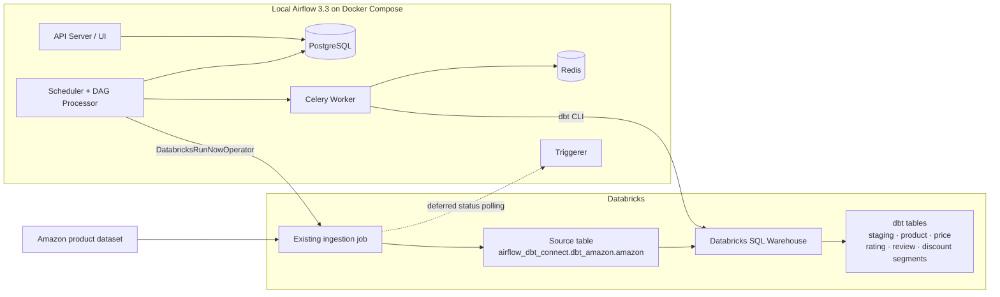
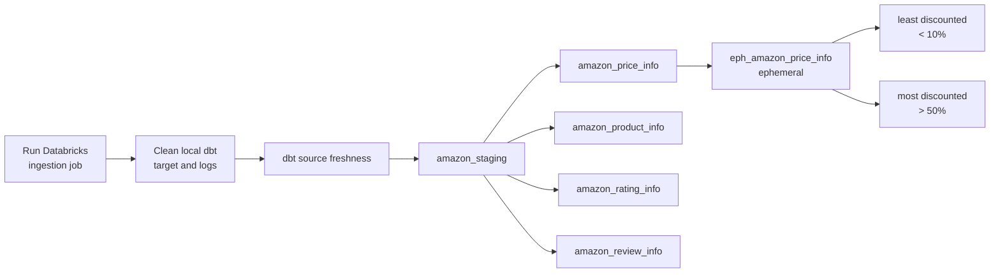

# Airflow + dbt + Databricks Analytics Pipeline

[](https://airflow.apache.org/)
[](https://www.getdbt.com/)
[](https://www.databricks.com/)
[](https://www.docker.com/)

An end-to-end analytics engineering project that uses **Apache Airflow** to orchestrate Databricks ingestion and **dbt** transformations for an Amazon product dataset. The local Airflow environment runs on Docker Compose with CeleryExecutor, PostgreSQL, and Redis, while Databricks provides the ingestion job and SQL compute layer.

> This project demonstrates cross-platform orchestration, deferrable Databricks job execution, dbt model dependencies, source checks, data testing, and containerized Airflow infrastructure.

## Architecture



See [Architecture](docs/ARCHITECTURE.md) for deployment, task-flow, and sequence diagrams. See [dbt lineage](docs/DBT_LINEAGE.md) for the transformation graph and model reference.

## Pipeline flow

The `orchestrate` DAG is manually triggered (`schedule=None`) and runs these stages:



Independent branches run in parallel once `amazon_staging` succeeds. The Databricks operator is deferrable, allowing its worker slot to be released while the Triggerer polls the remote run.

## Technology stack

| Area | Technology | Role |
|---|---|---|
| Orchestration | Apache Airflow 3.3 | DAG scheduling, dependency management, and monitoring |
| Distributed task execution | CeleryExecutor + Redis | Queues dbt and orchestration tasks to the worker |
| Airflow metadata | PostgreSQL 16 | Persists DAG runs, task state, and metadata |
| Data platform | Databricks | Runs ingestion and hosts the source and transformed tables |
| Transformation | dbt Core + dbt-databricks | Builds documented, testable SQL models |
| Runtime | Docker Compose | Runs the local multi-service Airflow environment |

## dbt models

All Amazon models are materialized as tables unless explicitly configured as ephemeral.

| Model | Purpose | Materialization |
|---|---|---|
| `amazon_staging` | Thin staging layer over the registered Amazon source | Table |
| `amazon_product_info` | Unique product attributes and links | Table |
| `amazon_price_info` | Unique price and discount combinations | Table |
| `amazon_rating_info` | Unique product rating information | Table |
| `amazon_review_info` | Unique review and reviewer information | Table |
| `eph_amazon_price_info` | Parses percentage text into an integer | Ephemeral |
| `amazon_least_discounted_products` | Products with parsed discounts below 10% | Table |
| `amazon_most_discounted_products` | Products with parsed discounts above 50% | Table |

## Repository structure

```text
.
├── dags/
│   └── orchestrate.py                 # Airflow DAG and task dependencies
├── dbt_databricks/
│   ├── dbt_project.yml                # dbt project and materializations
│   ├── profiles.yml                   # Databricks adapter profile template
│   ├── models/
│   │   ├── source/sources.yml         # Databricks source declaration
│   │   └── amazon/                    # Staging and analytical SQL models
│   └── tests/amazon_stg_test.sql      # Singular product_id test
├── config/airflow.cfg
├── Dockerfile                         # Airflow image with Python dependencies
├── docker-compose.yaml                # Local CeleryExecutor stack
└── requirements.txt
```

## Prerequisites

- Docker Engine with Docker Compose
- At least 4 GB RAM, 2 CPUs, and adequate free disk for the local Airflow stack
- A Databricks workspace and SQL warehouse
- An existing Databricks ingestion job that creates or refreshes the Amazon source table
- A Databricks personal access token or supported authentication method
- Permission to run the Databricks job and create tables in the configured catalog/schema

## Configuration

### 1. Create a local environment file

Copy the included template and generate unique secrets:

```bash
cp .env.example .env
```

Never commit `.env`. If a real credential was previously committed, remove it from history and rotate it; deleting only the current file does not invalidate an exposed secret.

### 2. Configure the Airflow Databricks connection

Create a connection named exactly:

```text
databricks_amazon_jobs
```

Set the Databricks workspace host and authentication credentials. The DAG uses this connection with `DatabricksRunNowOperator`.

### 3. Configure the ingestion job

The DAG currently references a workspace-specific numeric `job_id` in `dags/orchestrate.py`. Replace it with the job ID from your workspace, or parameterize it through an Airflow Variable or environment variable.

The job must populate:

```text
airflow_dbt_connect.dbt_amazon.amazon
```

### 4. Configure dbt

Update `dbt_databricks/profiles.yml` with your Databricks host, warehouse HTTP path, and authentication. For team or CI use, reference environment variables instead of storing secrets in the file.

The current project target is:

```text
catalog: airflow_dbt_connect
schema:  dbt_amazon
```

## Run locally

### 1. Build and initialize Airflow

```bash
docker compose build
docker compose up airflow-init
```

### 2. Start the services

```bash
docker compose up -d
```

Open the Airflow UI at [http://localhost:8080](http://localhost:8080). The default local credentials in the Compose configuration are `airflow` / `airflow` unless overridden in `.env`.

### 3. Verify dbt connectivity

```bash
docker compose exec airflow-worker bash -lc \
  "cd /opt/airflow/dbt_databricks && dbt debug"
```

### 4. Trigger the pipeline

Unpause and trigger `orchestrate` from the Airflow UI, or use the CLI container:

```bash
docker compose run --rm airflow-cli dags unpause orchestrate
docker compose run --rm airflow-cli dags trigger orchestrate
```

### 5. Inspect results

Use the Airflow Grid view for task status and the Databricks catalog explorer to inspect generated models in `airflow_dbt_connect.dbt_amazon`.

## Test and document the dbt project

```bash
docker compose exec airflow-worker bash -lc \
  "cd /opt/airflow/dbt_databricks && dbt test"

docker compose exec airflow-worker bash -lc \
  "cd /opt/airflow/dbt_databricks && dbt docs generate"
```

The project currently includes:

- A generic `not_null` test on `amazon_staging.product_id`
- A singular warning-level test for null staging `product_id` values
- A source-freshness task in the DAG

To enforce an actual freshness SLA, add a loaded timestamp and `freshness` thresholds to `models/source/sources.yml`.

## Stop the environment

```bash
docker compose down
```

To remove the local PostgreSQL volume as well, use `docker compose down --volumes`. This deletes local Airflow metadata and should only be used when a full reset is intended.

## Example analytics

```sql
-- Highest discounts
SELECT product_id, actual_price, discounted_price, discount_percentage
FROM airflow_dbt_connect.dbt_amazon.amazon_most_discounted_products
ORDER BY CAST(REPLACE(discount_percentage, '%', '') AS INT) DESC;

-- Rating distribution
SELECT rating, COUNT(*) AS products
FROM airflow_dbt_connect.dbt_amazon.amazon_rating_info
GROUP BY rating
ORDER BY rating DESC;

-- Reviews by product
SELECT product_id, COUNT(*) AS reviews
FROM airflow_dbt_connect.dbt_amazon.amazon_review_info
GROUP BY product_id
ORDER BY reviews DESC;
```

## Production hardening

- Store credentials in a secrets backend rather than tracked files.
- Parameterize Databricks job, catalog, schema, and warehouse settings by environment.
- Run `dbt build` or add explicit downstream `dbt test` tasks to the DAG.
- Add source freshness metadata and thresholds.
- Replace model-by-model Bash tasks with a dbt-aware task group if richer lineage is required.
- Send task logs to remote storage and add alerting, retries, and execution timeouts.
- Remove generated logs, compiled dbt artifacts, Python bytecode, and local environment files from version control.

## Documentation

- [Architecture and orchestration flow](docs/ARCHITECTURE.md)
- [dbt lineage and model reference](docs/DBT_LINEAGE.md)
- [Security and operational guidance](docs/SECURITY_AND_OPERATIONS.md)

## Author

**Adarsh Damarla** · [GitHub](https://github.com/AdarshDamarla-DataEngineer-Git)


