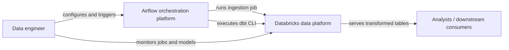
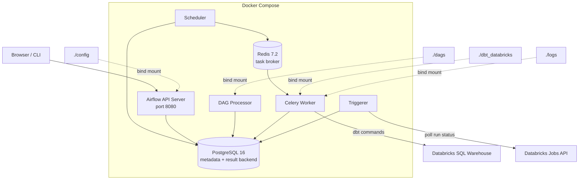
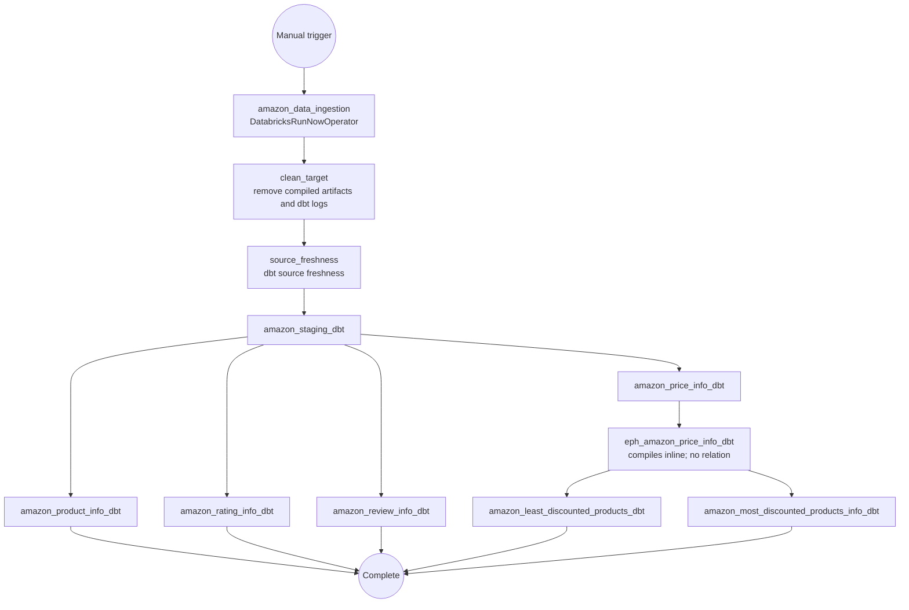
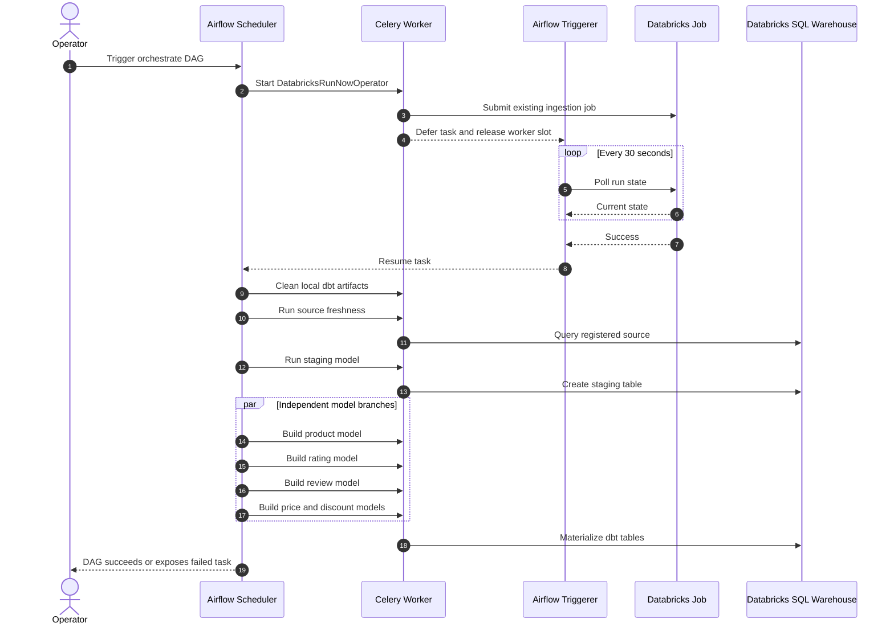
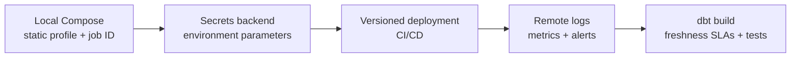

# Architecture

## System context

## Local Airflow deployment

## Orchestration DAG

The DAG has no schedule and no catch-up. Each run starts manually or through the Airflow API/CLI.

## End-to-end execution sequence

## Responsibility boundaries

| Component | Responsibility |
|---|---|
| Databricks ingestion job | Acquires and loads the Amazon source table; its implementation is external to this repository |
| Airflow DAG | Coordinates ingestion, cleanup, source check, and model execution |
| Triggerer | Polls the deferrable Databricks run without occupying a worker slot |
| Celery worker | Runs dbt CLI commands and non-deferred task work |
| Redis | Celery message broker |
| PostgreSQL | Airflow metadata database and Celery result backend |
| dbt | Resolves SQL model lineage, compiles Jinja, materializes relations, and executes tests |
| Databricks SQL warehouse | Executes dbt SQL against the configured catalog and schema |

## Failure behavior

- A failed Databricks ingestion run prevents all dbt work.
- A failed cleanup or source-freshness command prevents model execution.
- A failed staging model blocks every downstream model.
- Product, rating, review, and price branches run independently after staging; a failure in one does not prevent already-runnable sibling branches from executing.
- Failure of `amazon_price_info` blocks the ephemeral price transform and both discount-segment tables.

## Recommended production evolution

