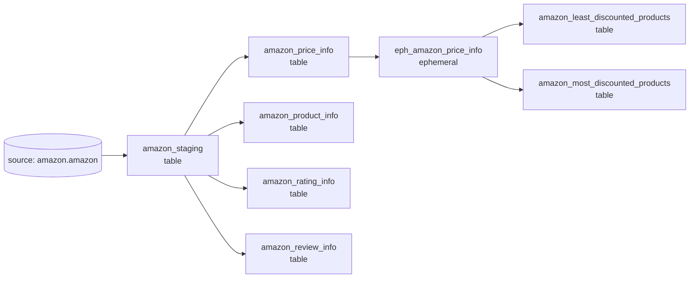

# dbt lineage and model reference

## Lineage graph



## Source

The source is declared in `models/source/sources.yml`:

```text
airflow_dbt_connect.dbt_amazon.amazon
```

The Airflow DAG triggers an external Databricks job before dbt runs. That job is expected to create or refresh this relation.

## Model catalog

### `amazon_staging`

- Upstream: `source('amazon', 'amazon')`
- Materialization: table
- Transformation: selects all source columns without renaming or casting
- Quality controls: a generic `not_null` test and a warning-level singular null test on `product_id`

### `amazon_product_info`

- Upstream: `amazon_staging`
- Grain: intended as one row per unique combination of product ID and descriptive product fields
- Fields: product identifier, name, category, description, image link, and product link
- Logic: groups by every selected field and keeps combinations appearing exactly once

### `amazon_price_info`

- Upstream: `amazon_staging`
- Grain: intended as one row per unique product/price/discount combination
- Fields: product ID, discounted price, actual price, and discount percentage
- Logic: groups by every selected field and keeps combinations appearing exactly once

### `amazon_rating_info`

- Upstream: `amazon_staging`
- Grain: intended as one row per unique product/rating/count combination
- Fields: product ID, rating, and rating count
- Logic: groups by every selected field and keeps combinations appearing exactly once

### `amazon_review_info`

- Upstream: `amazon_staging`
- Grain: intended as one row per unique product/reviewer/review combination
- Fields: product ID, user details, review ID, title, and review content
- Logic: groups by every selected field and keeps combinations appearing exactly once

### `eph_amazon_price_info`

- Upstream: `amazon_price_info`
- Materialization: ephemeral, so its SQL is compiled into downstream models rather than created as a table
- Logic: removes `%`, trims whitespace, and casts the discount percentage to an integer named `discount_percentage_new`

### Discount segment models

`amazon_least_discounted_products` selects products with a parsed discount below 10%. `amazon_most_discounted_products` selects products above 50%. Values exactly equal to 10% or 50% belong to neither model.

## Materializations

The project configuration materializes every model below `models/amazon` as a table, with the `ephemeral` subdirectory overriding that behavior for its models.

```yaml
models:
  databricks_amazon_project:
    amazon:
      +materialized: table
      ephemeral:
        +materialized: ephemeral
```

## Current tests

| Test | Target | Severity | Behavior |
|---|---|---|---|
| Generic `not_null` | `amazon_staging.product_id` | Error by default | Fails `dbt test` when null IDs exist |
| Singular SQL test | `amazon_staging.product_id` | Warn | Returns null-ID rows as test failures but reports warning severity |

The DAG runs individual `dbt run` commands but does not currently invoke `dbt test` or `dbt build`. Tests must be run separately unless test tasks are added.

## Modeling considerations

- `GROUP BY ... HAVING COUNT(*) = 1` excludes duplicate combinations entirely; it does not retain a single deduplicated row. Use `SELECT DISTINCT` or a deterministic `ROW_NUMBER()` strategy if the desired behavior is one retained record.
- Staging uses `SELECT *`, so upstream schema changes automatically flow into that table. Explicit columns and types make interface changes easier to control.
- Price and rating fields may arrive as formatted strings. Normalize currency symbols, separators, numeric types, and null-like values in staging for more reliable analytics.
- Define model descriptions and column tests for keys, accepted values, relationships, and numeric ranges.
- Add a source loaded-at field and freshness thresholds if `dbt source freshness` should enforce an SLA.
